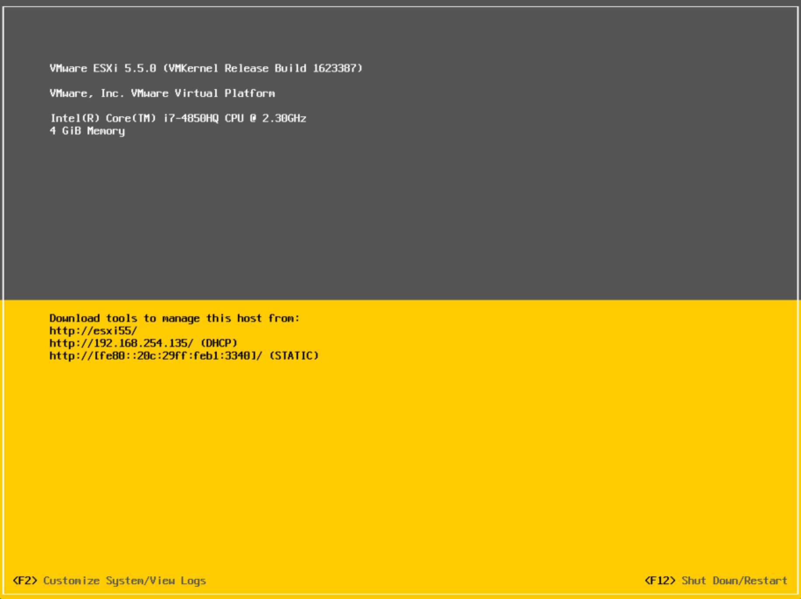
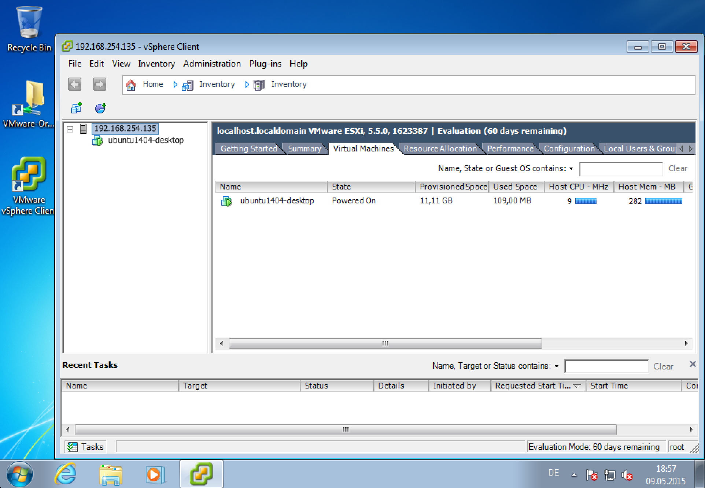

# ESXi playground

This `Vagrantfile` gives you a little playground to get started with ESXi 6.0.0 and the vSphere Client.

## Vagrant boxes

### esxi60

The basebox must be build with the [packer-esxi](https://github.com/StefanScherer/packer-esxi) repo.
Add an ESXi 6.0 box with the name `esxi60`.

After starting up the Vagrant box have a look at the IP address of the ESXi server.



### win7

The basebox must be build with the [packer-windows](https://github.com/StefanScherer/packer-windows) repo.
Add a Windows 7 box with the name `windows_7`.

After starting up the Vagrant box the VMware vSphere Client 6.0.0 will be installed.

Connect with it to your ESXi server to `192.168.254.135` and user `root` and password `vagrant`.



### Install Vagrant plugin

To provision the ESXi Vagrant box you have to install the Vagrant ESXi plugin:

```
vagrant plugin install vagrant-esxi
```

### Build the boxes

Just create the two Vagrant boxes with

```
vagrant up --provider vmware_fusion
```

## Create a Vagrant box inside the ESXi server

Go into the `ubuntu` sub directory and build this basebox with `packer` and your just created ESXi server.

Just set the IP address as variable so packer can connect to your ESXi server.

```
cd ubuntu
packer build -var 'remote_host=192.168.254.135' ubuntu1404-desktop-esx.json
```

This Ubuntu basebox is the work of all the Box-Cutter maintainers and contributors. You can find the original repo at [https://github.com/boxcutter/ubuntu](https://github.com/boxcutter/ubuntu).
